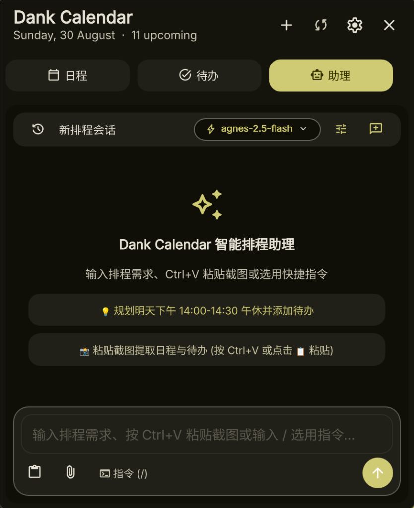
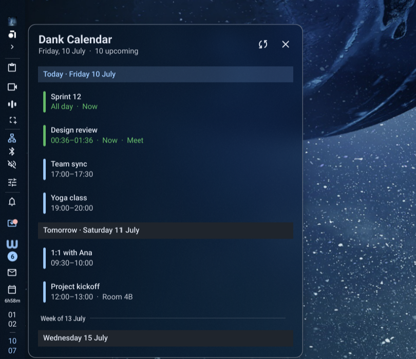

# 📅 Dank Calendar Plus

<div align="center">

[](https://github.com/AvengeMedia/DankMaterialShell)
[](https://github.com/luckjokerwang/dms-dankcalendar)
[](LICENSE)
[](https://github.com/luckjokerwang/dms-dankcalendar)

**A next-generation, AI-powered Agenda & Tasks management widget for [DankMaterialShell](https://github.com/AvengeMedia/DankMaterialShell) & [dcal](https://github.com/AvengeMedia/dcal).**

*为 DankMaterialShell 打造的全能日历待办扩展：顶栏动态预算胶囊、沉浸式日程/待办弹窗、智能 AI 排程助理、图片识别与全自动同步。*

</div>

---

## 📸 界面预览 (Screenshots)

<div align="center">
  <p><b>🤖 智能 AI 排程助理 (AI Scheduling Assistant)</b></p>
  
</div>

<br />

<div align="center">
  <p><b>📅 统一沉浸式弹窗 (Agenda & Tasks Popout View)</b></p>
  
</div>

---

## 🌟 核心特性 (Key Features)

### 🤖 1. 智能 AI 排程助理 (AI Scheduling Assistant)
- **多大模型广泛兼容**：原生支持 **OpenAI、DeepSeek（deepseek-chat / deepseek-reasoner）、Claude、Google Gemini、Ollama** 以及任意标准 OpenAI 协议兼容端点，支持自定义 Base URL、API Key 与可用模型自由多选。
- **自然语言与快捷指令**：键入 `/` 快速调出内置指令面板（如快速规划明天下单、整理全天待办、查询空闲时间）。
- **截图 OCR 快速提取**：按下 `Ctrl+V` 或点击附件按钮一键粘贴系统剪贴板截图，AI 自动识别图片中的会议、课表、待办事项并格式化排程。
- **交互式确认卡片**：AI 输出结构化排程建议，支持勾选/取消单个日程或待办，点击一键批量写入系统，**自动触发后端同步与两段式防漏刷新**。
- **深度交互打磨**：
  - 支持 **一键复制** 与鼠标自由划词复制；
  - 支持 **`↑ / ↓` 方向键** 快速回溯历史提问需求（ChatGPT / 终端级丝滑体验）；
  - 侧边栏历史会话管理，并支持根据对话内容自动生成智能会话标题。

---

### 📅 2. 沉浸式日程视图 (Agenda Management)
- **顶栏动态剩余空间预算算法 (Dynamic Budget Allocation)**：
  - 将设置中的胶囊宽度定义为全局预算，标题区域自适应扣除右侧动态倒计时（如 `1h`, `14h15m`）的宽度；
  - **彻底消除尺寸抖动**：无论倒计时是长是短、无论切换日程还是待办，顶栏胶囊在屏幕上的**总像素宽度 100% 绝对恒定**！
- **精准本地与 UTC 时区换算**：深度解决跨天与凌晨（00:00~08:00）事件的时区偏移问题，零漏查每一项早间日程。
- **多显示器状态实时同步**：基于 `PluginGlobalVar`，跨屏多监视器实时同步展开、切换与刷新状态。
- **平滑跑马灯 (Marquee)**：长事件标题在受限视口中自动无缝往复平滑滚动。

---

### ⚡ 3. 全功能待办清单 (Tasks Management)
- **0ms 极速乐观 UI (Optimistic Updates)**：勾选、取消、删除、快速添加即时生效，内置 FIFO 串行队列保证并发安全与 SQLite 数据完整。
- **DMS 原生输入体验**：快速创建栏采用 DMS 官方原生标准组件 `DankTextField`，像素级保证占位符、输入文字、`+` 图标与右侧提交按钮的**光学中心严丝合缝**。
- **RFC 5545 优先级与快捷输入**：支持 🔴 高优、🟡 中优、🔵 低优 状态标签，创建时输入 `!1` / `!h`、`!2` / `!m`、`!3` / `!l` 即可快速标记优先级。
- **多日历分类筛选**：支持按列表/分类标签一键过滤待办任务。
- **顶栏纯数字精简**：顶栏待办模式精简显示为 `[ ✓  7 • 任务标题... ]`，最大限度释放空间展示具体任务文本。

---

### ⚙️ 4. 丰富的设置项 (Customizable Settings)
- **显示模式切换**：完整模式 (`标题 • 倒计时`)、仅倒计时、仅标题。
- **胶囊最大宽度**：支持在 `40px ~ 400px` 之间自由调节（默认 200px）。
- **轮播展示开关**：可开启日程与待办定时自动轮播。
- **历史与未来跨度**：自定义日程回溯天数与未来预览天数。
- **模型服务配置**：支持在图形设置界面中完成模型测试、激活切换与参数调整。

---

## 🕹️ 快捷操作指引 (Quick Actions & Shortcuts)

| 操作 (Action) | 触发效果 (Result) |
|---|---|
| **左键点击顶栏胶囊图标** | 在 **日程模式** 与 **待办模式** 之间循环切换（所有显示器同步） |
| **左键点击顶栏胶囊主体** | 打开 / 收起 沉浸式浮动弹窗 (Popout) |
| **中键点击顶栏胶囊** | 快速调出 DankCalendar 主应用程序窗口 |
| **右键点击胶囊 / 点击 ↻** | 触发底层账户全量同步（`dcal ipc accounts.refresh`），带 360° GPU 加速旋转动效 |
| **弹窗 `+` 按钮** | 在 DankCalendar 中打开新建事件界面 |
| **待办输入框回车** | 快速创建待办（支持输入 `!1` 设为高优，`!2` 设为中优） |
| **AI 助理 `Ctrl+V`** | 自动提取并上传剪贴板图片/截图进行 AI 识图排程 |
| **AI 输入框 `↑ / ↓`** | 快速向上/向下切换回溯历史输入的 Prompt 提示词 |

---

## 📦 依赖与环境需求 (Requirements)

- **Linux / Wayland** (DankMaterialShell 桌面环境)
- **[dcal](https://github.com/AvengeMedia/dcal)** (DankCalendar 守护进程与 IPC 接口)
- **Python 3** (>= 3.9)
- **jq** (命令行 JSON 处理工具)
- **wl-clipboard** 或 **xclip** (用于剪贴板识图与一键复制功能)

---

## 📥 安装方法 (Installation)

### 方式一：DMS 插件管理器一键安装
在 DMS 设置 -> 插件管理中搜索 `Dank Calendar Plus` 并点击安装。

### 方式二：手动克隆安装
```bash
cd ~/.config/DankMaterialShell/plugins/
git clone https://github.com/luckjokerwang/dms-dankcalendar.git dankCalendarAgendaLocal

# 清除缓存并重启 DMS 生效
rm -rf ~/.cache/DankMaterialShell ~/.cache/quickshell
dms restart
```

---

## 📄 开源协议 (License)

本项目采用 **GPL-3.0-or-later** 许可证发布。
Upstream 基础代码采用 MIT 许可证 © [Leonardo Amaro](https://github.com/leoamaro01) (见 `LICENSE.upstream`)。

---

## 💖 致谢 (Credits)

- **本项目维护与增强**：[luckjokerwang](https://github.com/luckjokerwang)
- **Fork 自**：[arqueon/dms-dankcalendar](https://github.com/arqueon/dms-dankcalendar)
- **原始插件作者**：[Leonardo Amaro](https://github.com/leoamaro01)
- **平台支持**：[AvengeMedia / DankMaterialShell](https://github.com/AvengeMedia/DankMaterialShell)

